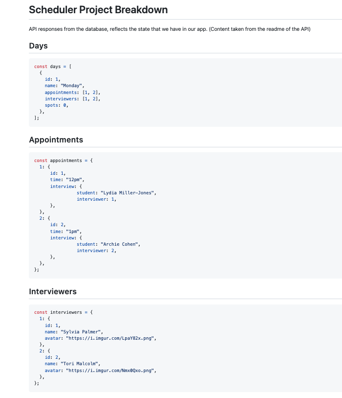
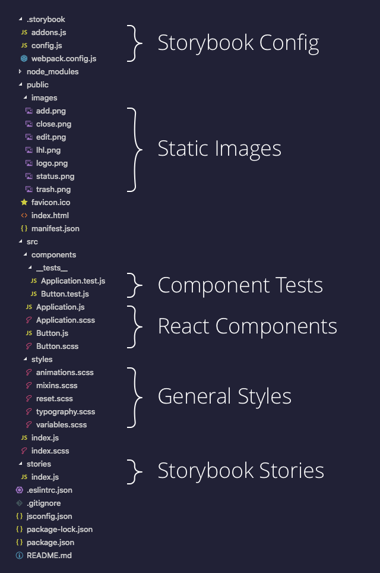

# Interview Scheduler - Stella Maris


## About

Interviewer Scheduler is a React app that allows user to book, edit and cancel an interview appointment with interviewers.  To book an interview appointment, a user can choose an available appointment slot, provide a student name and choose an interviewer.  


## Setup

Install dependencies with `npm install`.

### Dependancies
- axios
- classnames
- normalize.css
- react
- react-dom
- react-scripts

Fork and clone the [scheduler-api] (https://github.com/lighthouse-labs/scheduler-api) into a new directory, NOT within our current scheduler directory, and follow the README.md instructions to configure and run the API server.


## Running Webpack Development Server

```sh
npm start
```

Visit, http://localhost:8000/


## Running Jest Test Framework

```sh
npm test
```


## Running Storybook Visual Testbed

```sh
npm run storybook
```
Visit, http://localhost:9009/ 


## Scheduler Project Breakdown







## Final Product


