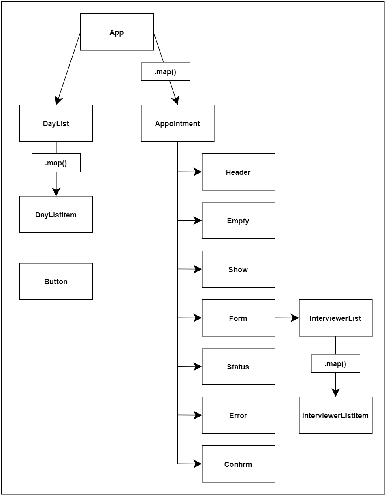

# Interview Scheduler


## Setup

Install dependencies with `npm install`.

## Running Webpack Development Server

```sh
npm start
```

http://localhost:8000/

## Running Jest Test Framework

```sh
npm test
```

## Running Storybook Visual Testbed

```sh
npm run storybook
```
http://localhost:9009/ 


## Scheduler Project Breakdown




